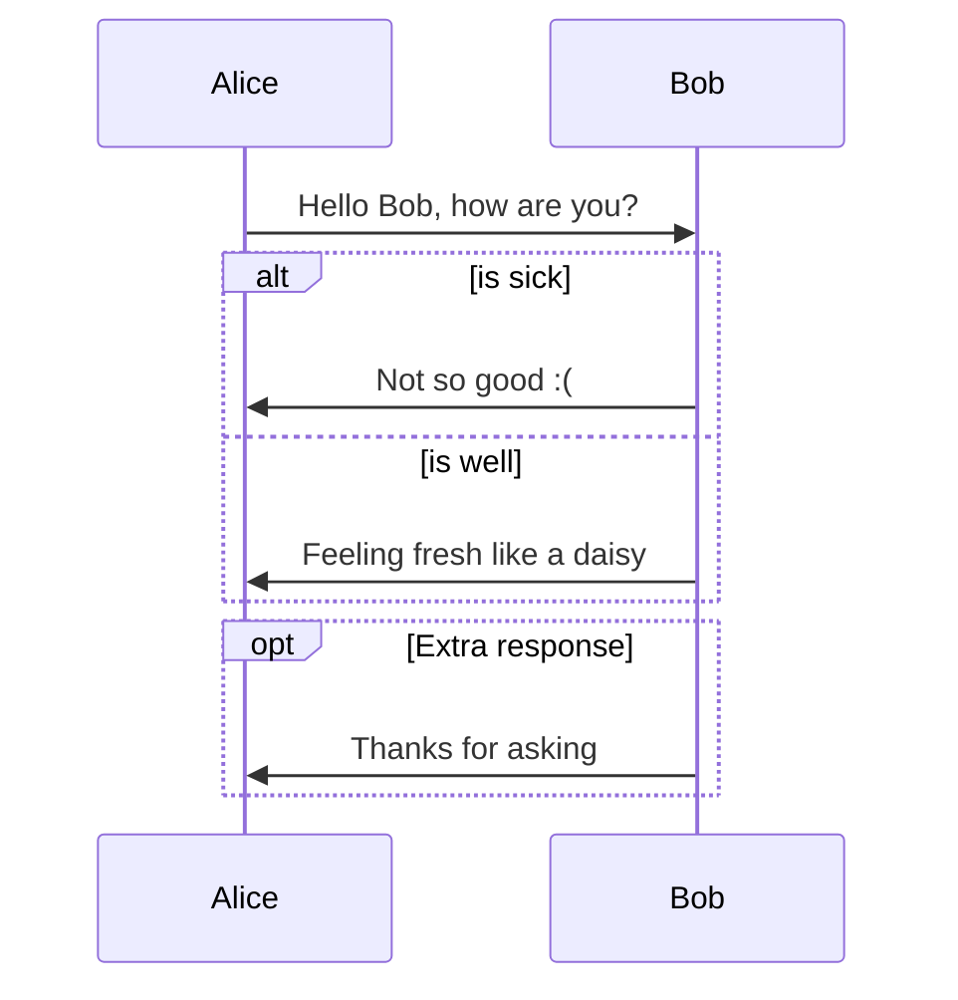
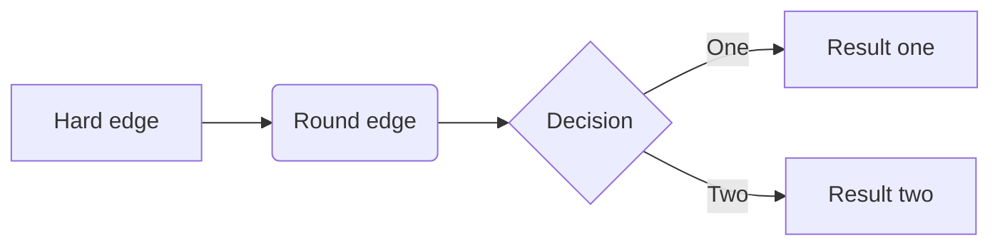
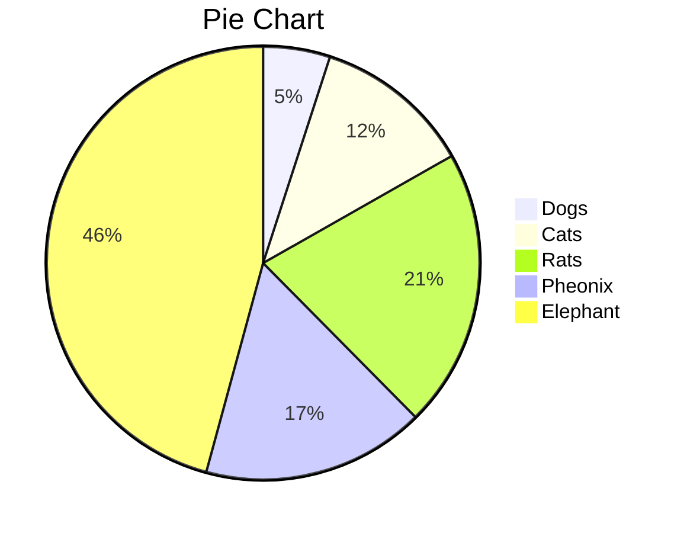

# 高效笔记：使用Typora+Markdown制作并管理电子笔记

关键字：`Markdown 语法`，`Typora的安装及使用`

## 初见 Typora 和 Markdown

Markdown 是一种超`轻量级标记语言`，在 2004 由苹果公司分析师 John Gruber 创建，文档后缀为 .md 或 .markdown。

Typora 是一个简洁易用的`Markdown编辑器`。

对于`理工科学生、程序员、研究人员`，甚至`作家、翻译家`来说，Typora 和 Markdown 的组合在效率上**远远优于**市面上的 OneNotx、印 x 笔记等产品。

### 为什么使用 Markdown？

**语法简单**，一目了然，**不影响阅读**。

Markdown 文档可以轻松被**转化为网页 、Word、图像、PDF、LaTeX、Epub** 等多种格式的文档。

Markdown 支持插入**代码块**、复杂的**数学公式**。

Markdown 支持绘制**思维导图**、**流程图**、**顺序图**，以及插入图像。

### 为什么使用 Typora？

**所见即所得**，界面简洁，节省屏幕空间。

支持**拼写检查**，**提升效率**，便于管理阅读大量笔记。

## 安装 Typora

在[Typora 官网](https://typora.io/#download)下载安装包，即可轻松安装。

### Typora 的布局


### 使用 Typora 管理笔记

在 Windows 中新建文件夹以容纳笔记，并直接使用 Typora 打开文件夹。这样，就可以在**文件**选项卡中任意切换笔记。

### 个性化设置

1. 在 Typora 的**偏好设置-外观**中，可以将窗口改为“一体化”以获取更简洁的操作界面。
2. 为了打开 Typora 即自动继续工作，可以在**偏好设置-启动选项**中，选择“**重新打开上次使用的文件和目录**”。
3. 在**偏好设置-Markdown**，可以根据自己的需求，开启**内连公式、上标、下标、图表**等功能。
4. Typora 自带五个主题。可以访问[theme.typora.io](https://theme.typora.io/)获取并安装更多主题。

## Markdown 基本语法

### 1 分级标题

在文字前端添加 1 至 6 个“#”和一个空格，代表不同级别的标题。
“# ”开头，代表最高级标题。
“## ”开头，代表二级标题，以此类推，最多设置六级标题。

原文举例：

```markdown
# 母猪的产后护理

## 一、猪的分类

### 1.1 中原野猪
……

```

### 2 粗体、斜体、关键字、下划线

_斜体字_：使用**星号**“\*”包围内容。

**粗体字**：使用**双星号**“\*\*”包围内容。

<u>下划线</u>：使用“\<u\>”和“\</u\>"包围内容。

`关键字`：使用**反单引号**“`”包围内容。

原文举例：

```markdown
_斜体字_ **粗体字** <u>下划线</u> `关键字`
```

> 键入反单引号：单击 Tab 上方的按键。

### 3 列表

#### 3.1 无序列表

- 使用“\*”或“-”后增加**空格**，代表无序列表。
  - 在“\*”或“-”前插入**两个空格**（或 Tab），代表次级列表。


#### 3.2 有序列表

1. 在“数字”后增加英文句号“."和**空格**“ ”，代表有序列表。
   1. 在“数字”、英文句号“."、**空格**“ ”前插入**两个空格**（或 Tab），代表次级列表。

> 有序列表和无序列表**可以混合使用**。
>
> 有序列表的**序号是自动排列**的。

#### 3.3 复选框列表

在“数字”、英文标点“.”后添加“[ ]” 代表未勾选；添加“[x]”代表已勾选。

1. [x] 步骤一
2. [ ] 步骤二
3. [ ] 结束


### 4 常用格式

#### 4.1 引用

> 在内容前方添加小于号“>”和空格。
>
> 引用中，**可以使用**列表，各种字体样式。
>
> 1. 引用中使用有序列表
>
> - 引用中使用无序列表

#### 4.2 脚注

在需要脚注的文字后，添加左中括号“\[”，乘方符号“\^”，自定义的标记“标记”、右中括号“\]”，这将形成一个脚注的起始点。例如本处的脚注[^jiaozhu]

在文章后方，输入**同样的符号组合**，并接以**英文冒号**“:”和空格“ ”，然后键入作为脚注的内容。

举例：

```markdown
此处应有一个脚注[^jiaozhu]。这里还有[^haiyou]。

[^jiaozhu]: 这里写需要注释的内容。

[^haiyou]: 这是第二个注释。
```

> 脚注是自动排序的，无需使用者关心。

#### 4.3 插入超链接

超链接的**文本用英文中括号**包括，将**地址用英文小括号**包括。
例如：[谷歌](https://www.google.com/)

其原文为：

```markdown
[谷歌](https://www.google.com/)
```

> 超链接**支持相对地址**。

#### 4.4 插入图片

与超链接类似，只需在最前方添加英文叹号“!”。

例如：


其原文为：

```markdown

```

> **本地图片**最好使用**相对地址**，方便图片随 Markdown 文档转移位置。

#### 4.5 插入分隔线

单独出现为一行的三个星号“\*\*\*”，即是横线。

---

#### 4.6 插入换行

在需要换行的段内，使用“\<br\>”换行。

#### 4.6 转义

如果要输出的内容，已经是 Markdown 的关键字，那么在前方输入反斜杠“\\”。

### 5 数学公式

Markdown 可以使用`LaTeX表达式`显示数学、物理、化学、生物公式。（调用了 MathJax。）

#### 5.1 行内公式

在文章段落中包含公式，可用货币符号“\$”符号将 LaTeX 表达式包围。如：$$f = \frac{2 \pi}{T}$$

> Typora 使用行内公式时，需要在“文件-首选项-Markdown-语法支持”中勾选“行内公式”复选框。

> Jekyll 的行内公式使用**两个**“$”包围，Typora 则是一个。

#### 5.2 公式块

使用另外的段落显示公式，则第一行以**两个货币符号**“\$”开头，中间输入 LaTeX 表达式，最后以**两个货币符号**“\$”结尾。

$$
\begin{align*}
y = y(x,t) &= A e^{i\theta} \\
&= A (\cos \theta + i \sin \theta) \\
&= A (\cos(kx - \omega t) + i \sin(kx - \omega t)) \\
&= A\cos(kx - \omega t) + i A\sin(kx - \omega t)  \\
&= A\cos \Big(\frac{2\pi}{\lambda}x - \frac{2\pi v}{\lambda} t \Big) + i A\sin \Big(\frac{2\pi}{\lambda}x - \frac{2\pi v}{\lambda} t \Big)  \\
&= A\cos \frac{2\pi}{\lambda} (x - v t) + i A\sin \frac{2\pi}{\lambda} (x - v t)
\end{align*}
$$

### 6 绘制流程图、顺序图

各类图表借助 Mermaid 插件实现。参见：https://support.typora.io/Draw-Diagrams-With-Markdown/

Mermaid支持顺序图、流程图、类图、状态图、甘特图等多种类型。

#### 6.1 顺序图



#### 6.2 流程图



#### 6.3 饼图



### 7 代码块

代码前方键入**三个反单引号**“```”，并输入**编程语言名称**（如：python），表示代码**开始**。

代码后方健入**三个反单引号**“```”，表示代码**结束**。

```python
## Python 快速排序
def partition(arr,low,high):
    i = ( low-1 )
    pivot = arr[high]
    for j in range(low , high):
        if   arr[j] <= pivot:
            i = i+1
            arr[i],arr[j] = arr[j],arr[i]
    arr[i+1],arr[high] = arr[high],arr[i+1]
    return ( i+1 )

def quickSort(arr,low,high):
    if low < high:
        pi = partition(arr,low,high)
        quickSort(arr, low, pi-1)
        quickSort(arr, pi+1, high)
```

### 8 更多功能

除了上述基础功能，Markdown 还支持：

1. 生成清晰的表格
2. 自动生成目录
3. 嵌入 HTML5 标记语言

## Markdown 笔记的哲学

Markdown 定义的多种默认格式，涵盖了 90%文档所需。

省去了用户自己设计文档格式的时间，全都交由软件处理。

没有设计就是最好的设计，生成的文档统一、标准、简洁。

[^jiaozhu]: 这是一个脚注的示例。
